# AxonFlow 🧠⚡

> **AI-Powered Autonomous Mind-Mapping Engine** — Transform messy ideas into structured knowledge graphs at the speed of thought.

[](./LICENSE)
[](https://nodejs.org/)
[](https://react.dev/)
[](https://python.org/)
[](https://www.mongodb.com/)

---

## 📌 Table of Contents

- [Overview](#-overview)
- [Key Features](#-key-features)
- [Architecture Overview](#-architecture-overview)
- [Tech Stack](#-tech-stack)
- [Project Structure](#-project-structure)
- [Database Schema](#-database-schema)
- [API Reference](#-api-reference)
- [Data Flow](#-data-flow)
- [Getting Started](#-getting-started)
- [Environment Variables](#-environment-variables)
- [System Design](#-system-design)
- [Use Case Diagram](#-use-case-diagram)
- [UML Class Diagram](#-uml-class-diagram)
- [Frontend Component Architecture](#-frontend-component-architecture)
- [Roadmap](#-roadmap)
- [License](#-license)

---

## 🌟 Overview

**AxonFlow** is a next-generation, full-stack mind-mapping platform that combines an interactive canvas editor with AI-powered node generation. It enables users to visually brainstorm, plan projects, and explore logical flows — powered by local LLMs (via Ollama) for intelligent subtopic generation and complete mind map auto-creation.

The project uses a **monorepo architecture** with three independently deployable services:

| Service | Technology | Port | Purpose |
|---------|-----------|------|---------|
| **Frontend** | React 19 + Vite | `5173` | Interactive canvas UI with React Flow |
| **Backend** | Node.js + Express 5 | `5000` | REST API, data persistence, file uploads |
| **AI Engine** | Python + FastAPI | `8001` | LLM-powered node generation via Ollama |

---

## ✨ Key Features

### 🗺️ Mind Map Canvas
- **Interactive React Flow canvas** with drag-and-drop node manipulation
- **Three layout modes**: Horizontal (D3 column-based), Vertical (top-down tree), Radial (polar coordinates)
- **Four color palettes**: Mono, Vibrant, Pastel, Neon — applied per branch hierarchy
- **Keyboard shortcuts**: `Tab` (add child), `Enter` (add sibling), `F2` (rename), `Del` (delete)
- **Drag-to-reparent**: Drag a node onto another to change its parent relationship
- **D3-powered auto-layout**: Uses `d3-hierarchy` with custom column-width calculations

### 🤖 AI-Powered Generation
- **Sub-topic generation**: Select any node → ask AI to generate 4–6 child ideas
- **Full auto-map creation**: Provide a topic → AI generates a complete hierarchical mind map
- **Real-time streaming (SSE)**: Token-by-token AI responses streamed to the UI
- **Multi-model support**: Choose from available Ollama models (LLaMA 3, Mistral, Gemma, etc.)
- **Tool-augmented agents**: Optional web search and file reading capabilities via LangChain

### 📂 Organization & Management
- **Workspaces**: Top-level categories to group related maps
- **Nested folders**: Infinite folder nesting within workspaces
- **Favorites system**: Pin important maps for quick access
- **Soft-delete (Trash)**: Recoverable deletion with restore capability
- **Map duplication**: Deep-clone entire maps including all node trees
- **Bulk operations**: Multi-select maps for batch trash/favorite operations

### 📝 Rich Node Content
- **Notes**: Attach text notes to any node
- **Links**: Add titled URL references to nodes
- **File attachments**: Upload files and attach them to specific nodes
- **Status tags**: Mark nodes as Reading, Completed, Incomplete, Important, or Revise
- **Expand/Collapse**: Toggle subtree visibility for focused exploration

### 🎨 UI/UX
- **Multi-theme support**: Dark, Light, and Neon themes with CSS custom properties
- **Bulk import**: Paste indented text to auto-create nested node hierarchies
- **Global sidebar**: Persistent navigation with recursive workspace folder tree
- **Responsive design**: Tailwind CSS-powered layouts adapting to screen sizes
- **Optimistic updates**: Instant UI feedback before API confirmation

---

## 🏗 Architecture Overview

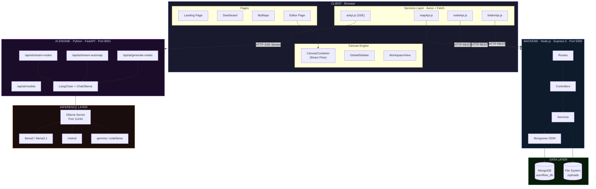

---

## 🛠 Tech Stack

### Frontend
| Technology | Version | Purpose |
|-----------|---------|---------|
| React | 19.2 | UI component framework |
| Vite | 8.x | Build tool & dev server |
| React Flow (`@xyflow/react`) | 12.x | Interactive canvas & graph rendering |
| d3-hierarchy | 3.x | Tree layout algorithms (horizontal, vertical, radial) |
| React Router DOM | 7.x | Client-side routing & navigation |
| Axios | 1.x | HTTP client for REST API calls |
| Tailwind CSS | 4.x | Utility-first CSS framework |
| Lucide React | 1.x | Icon library |
| Framer Motion | 12.x | Animation library |

### Backend
| Technology | Version | Purpose |
|-----------|---------|---------|
| Node.js | 18+ | Server runtime |
| Express | 5.x | Web framework |
| Mongoose | 9.x | MongoDB ODM |
| Multer | 2.x | File upload middleware |
| CORS | 2.x | Cross-origin resource sharing |
| dotenv | 17.x | Environment variable management |
| Clerk SDK | 4.x | Authentication (prepared, currently mock) |

### AI Engine
| Technology | Purpose |
|-----------|---------|
| FastAPI | Async Python web framework |
| LangChain + LangChain-Ollama | LLM orchestration framework |
| Ollama | Local LLM inference server |
| Pydantic | Request/response validation |
| httpx | Async HTTP client |
| BeautifulSoup4 | Web scraping tool (agent capability) |
| DuckDuckGo-Search | Web search tool (agent capability) |

---

## 📁 Project Structure

```
AxonFlow/
├── frontend/                          # React + Vite Application
│   ├── src/
│   │   ├── main.jsx                   # App bootstrap (StrictMode, AuthProvider, BrowserRouter)
│   │   ├── App.jsx                    # Root component — sets up Axios interceptors + routes
│   │   ├── routes.jsx                 # Route definitions with ProtectedRoute wrapper
│   │   ├── index.css                  # Global styles & CSS custom properties (themes)
│   │   │
│   │   ├── context/
│   │   │   └── authContext.jsx        # Auth state (login/logout/user) via React Context API
│   │   │
│   │   ├── pages/
│   │   │   ├── LandingPage.jsx        # Public hero page with login modal
│   │   │   ├── Dashboard.jsx          # Main hub: templates, AI generator, recent maps
│   │   │   ├── MyMaps.jsx             # Map listing with filter modes (all/favorites/trash/shared)
│   │   │   ├── WorkspaceView.jsx      # Workspace & folder browser with breadcrumb navigation
│   │   │   └── Editor.jsx             # Mind map editor page — loads CanvasContainer
│   │   │
│   │   ├── components/
│   │   │   ├── GlobalSidebar.jsx      # Persistent nav sidebar with recursive folder tree
│   │   │   ├── TopBar.jsx             # Editor top bar (map name, save status, actions)
│   │   │   │
│   │   │   ├── Auth/
│   │   │   │   └── LoginModal.jsx     # Demo login modal overlay
│   │   │   │
│   │   │   ├── Canvas/
│   │   │   │   ├── CanvasContainer.jsx    # ReactFlow wrapper (ErrorBoundary + Provider)
│   │   │   │   ├── D3StyleNode.jsx        # Custom node renderer (dot + text + inline editing)
│   │   │   │   ├── D3BezierEdge.jsx       # Custom bezier edge with layout-aware curves
│   │   │   │   ├── ActionToolbar.jsx      # Canvas toolbar (layout/palette/import controls)
│   │   │   │   ├── FloatingToolbar.jsx    # Right-click context menu for nodes
│   │   │   │   ├── NodeRegistry.js        # Node type registration for React Flow
│   │   │   │   └── hooks/
│   │   │   │       ├── useCanvasState.js  # D3 layout computation & React Flow state sync
│   │   │   │       ├── useCanvasActions.js # CRUD operations (create/rename/delete/copy/paste)
│   │   │   │       ├── useCanvasEvents.js # Click, keyboard & hover event handlers
│   │   │   │       └── useDragReparent.js # Drag-drop node reparenting logic
│   │   │   │
│   │   │   ├── Dashboard/
│   │   │   │   ├── DashboardHeader.jsx    # Welcome greeting + search bar
│   │   │   │   ├── TemplateGrid.jsx       # Template cards (Mind Map, SWOT, Timeline, etc.)
│   │   │   │   ├── ActionCards.jsx        # Quick action cards (New Map, AI Generate)
│   │   │   │   ├── RecentMapsGrid.jsx     # Recently accessed maps grid
│   │   │   │   ├── AiGeneratorModal.jsx   # AI prompt input + model selector modal
│   │   │   │   └── ComingSoonModal.jsx    # Placeholder for upcoming templates
│   │   │   │
│   │   │   ├── Workspace/
│   │   │   │   ├── WorkspaceHeader.jsx    # Header with breadcrumbs & view mode toggle
│   │   │   │   ├── WorkspaceCard.jsx      # Workspace tile (icon + name)
│   │   │   │   ├── FolderCard.jsx         # Folder tile
│   │   │   │   └── CreateItemModal.jsx    # Generic create dialog (workspace/folder/map)
│   │   │   │
│   │   │   ├── Modals/
│   │   │   │   └── BulkImportModal.jsx    # Indented text → node tree parser modal
│   │   │   │
│   │   │   └── UI/
│   │   │       ├── MapCard.jsx            # Map card component (grid/list views, actions menu)
│   │   │       ├── ErrorBoundary.jsx      # React error boundary with fallback UI
│   │   │       └── UIComponents.jsx       # Shared reusable UI primitives
│   │   │
│   │   ├── services/api/
│   │   │   ├── client.js              # Axios instance + interceptors (auth headers)
│   │   │   ├── mapApi.js              # Map CRUD API (list, create, update, duplicate, bulk)
│   │   │   ├── nodeApi.js             # Node CRUD API (list, create, update, delete, bulk)
│   │   │   ├── folderApi.js           # Folder & workspace API (CRUD, rename, delete)
│   │   │   ├── aiApi.js               # AI engine API (models, SSE streaming)
│   │   │   └── index.js               # Barrel export
│   │   │
│   │   └── utils/
│   │       └── flowUtils.js           # D3 layout builder, color palettes, text parser
│   │
│   ├── index.html
│   ├── vite.config.js
│   └── package.json
│
├── backend/                           # Node.js Express Server
│   ├── src/
│   │   ├── index.js                   # Entry point — MongoDB connect + server start
│   │   ├── app.js                     # Express app config (CORS, JSON, auth middleware, routes)
│   │   │
│   │   ├── models/
│   │   │   ├── Map.js                 # Mongoose schema — map metadata (name, workspace, folder, tags)
│   │   │   ├── Node.js               # Mongoose schema — node content (name, notes, links, files, position)
│   │   │   ├── Folder.js             # Mongoose schema — folder hierarchy (name, workspace, parentId)
│   │   │   └── schema.md             # Schema documentation
│   │   │
│   │   ├── controllers/
│   │   │   ├── mapController.js       # Map request handlers
│   │   │   ├── nodeController.js      # Node request handlers
│   │   │   ├── folderController.js    # Folder & workspace request handlers
│   │   │   └── fileController.js      # File upload/download handlers
│   │   │
│   │   ├── services/
│   │   │   ├── mapService.js          # Map business logic (CRUD, duplicate with recursive node copy)
│   │   │   ├── nodeService.js         # Node business logic (CRUD, recursive delete, bulkWrite)
│   │   │   ├── folderService.js       # Folder business logic (CRUD, recursive delete, workspace ops)
│   │   │   └── fileStorageService.js  # Multer disk storage configuration
│   │   │
│   │   └── routes/
│   │       ├── index.js               # Route aggregator (/api prefix)
│   │       ├── mapRoutes.js           # Map route definitions
│   │       ├── nodeRoutes.js          # Node route definitions
│   │       ├── folderRoutes.js        # Folder & workspace route definitions
│   │       └── fileRoutes.js          # File upload/download route definitions
│   │
│   ├── uploads/                       # File upload storage directory
│   ├── .env.example
│   └── package.json
│
├── ai-engine/                         # Python FastAPI AI Service
│   ├── main.py                        # FastAPI app — endpoints (streaming SSE + REST)
│   ├── agent.py                       # LangChain agent logic (streaming + non-streaming)
│   ├── models.py                      # Pydantic request models (NodeGenRequest, AutoMapRequest)
│   ├── services.py                    # Permissions, Ollama model fetching, tool resolution
│   ├── utils.py                       # JSON extraction from LLM responses
│   ├── permissions.json               # Tool permission flags (web_search, file_read)
│   └── requirements.txt              # Python dependencies
│
├── docs/                              # Additional documentation
├── scripts/                           # Utility scripts
├── .gitignore
├── LICENSE                            # MIT License
├── startup.md                         # Project initialization log
└── README.md                          # ← You are here
```

---

## 🗄 Database Schema

AxonFlow uses a **Structural Flat-Tree Architecture** — separating file metadata from canvas content for performance and scalability.

### Hierarchy

```
Workspace (string) → Folder (nested) → Map (metadata) → Nodes (content)
```

### Maps Collection

| Field | Type | Description |
|:------|:-----|:------------|
| `name` | String | Name of the mind map |
| `userId` | String | Owner identifier (from Clerk/auth) |
| `rootNodeId` | ObjectId → Node | Reference to the root node |
| `workspace` | String | Top-level workspace category |
| `folderId` | ObjectId → Folder | Parent folder reference |
| `template` | String | Template used during creation |
| `isFavorite` | Boolean | Pinned to favorites sidebar |
| `isTrashed` | Boolean | Soft-delete flag |
| `tags` | [String] | Custom labels for filtering |
| `lastAccessedAt` | Date | Used for "Recently Viewed" sorting |
| `createdAt` | Date | Auto-generated timestamp |
| `updatedAt` | Date | Auto-generated timestamp |

### Nodes Collection

| Field | Type | Description |
|:------|:-----|:------------|
| `mapId` | ObjectId → Map | Parent map reference |
| `userId` | String | Owner identifier |
| `parentId` | ObjectId → Node | Parent node (null = root) |
| `name` | String | Display text content |
| `isExpanded` | Boolean | UI subtree visibility |
| `notes` | [String] | Attached text notes |
| `links` | [{title, url}] | Attached URL references |
| `files` | [{fileName, fileUrl}] | Attached file uploads |
| `status` | String | Tag: reading/completed/incomplete/important/revise |
| `x`, `y` | Number | Canvas coordinates |

### Folders Collection

| Field | Type | Description |
|:------|:-----|:------------|
| `name` | String | Folder name |
| `workspace` | String | Parent workspace |
| `parentId` | ObjectId → Folder | Parent folder (supports infinite nesting) |
| `userId` | String | Owner identifier |

---

## 📡 API Reference

### Map Endpoints (`/api/maps`)

| Method | Endpoint | Description |
|--------|----------|-------------|
| `GET` | `/list` | List maps with filters (`isFavorite`, `isTrashed`, `workspace`, `folderId`) |
| `POST` | `/create` | Create map + auto-generate root node |
| `PATCH` | `/:mapId/attributes` | Update map metadata (name, favorite, trash, tags) |
| `POST` | `/:mapId/duplicate` | Deep-clone map with all nodes |
| `PATCH` | `/bulk-attributes` | Bulk update multiple maps |

### Node Endpoints (`/api/nodes`)

| Method | Endpoint | Description |
|--------|----------|-------------|
| `GET` | `/map/:mapId` | Get all nodes for a map |
| `POST` | `/map/:mapId` | Create a child node |
| `PATCH` | `/:id` | Update node fields (name, notes, links, files, status) |
| `PATCH` | `/:id/position` | Update node x,y coordinates |
| `DELETE` | `/:id` | Recursive delete (node + all descendants) |
| `POST` | `/bulk-update` | Batch update nodes (MongoDB bulkWrite) |
| `POST` | `/bulk-create` | Batch insert multiple nodes |

### Folder & Workspace Endpoints (`/api/folders`)

| Method | Endpoint | Description |
|--------|----------|-------------|
| `GET` | `/workspaces/list` | List unique workspace names |
| `PATCH` | `/workspaces/rename` | Rename workspace across all folders and maps |
| `DELETE` | `/workspaces/:name` | Delete workspace (cascading) |
| `GET` | `/list` | List folders (filterable by workspace, parentId) |
| `POST` | `/create` | Create folder |
| `DELETE` | `/:id` | Recursive delete folder (subfolders + trash maps) |

### File Endpoints (`/api/files`)

| Method | Endpoint | Description |
|--------|----------|-------------|
| `POST` | `/upload` | Upload file (multipart form) |
| `GET` | `/:filename` | Download/serve uploaded file |

### AI Engine Endpoints (`/api/ai`) — Port 8001

| Method | Endpoint | Description |
|--------|----------|-------------|
| `POST` | `/stream-nodes` | SSE stream: generate 4–6 subtopics for a node |
| `POST` | `/stream-automap` | SSE stream: generate complete mind map tree |
| `POST` | `/generate-nodes` | Non-streaming subtopic generation |
| `POST` | `/auto-map` | Non-streaming full map generation |
| `GET` | `/models` | List available Ollama models |
| `GET` | `/permissions` | Read tool permission flags |
| `POST` | `/permissions` | Update tool permission flags |

---

## 🔄 Data Flow

### 1. Mind Map Creation Flow

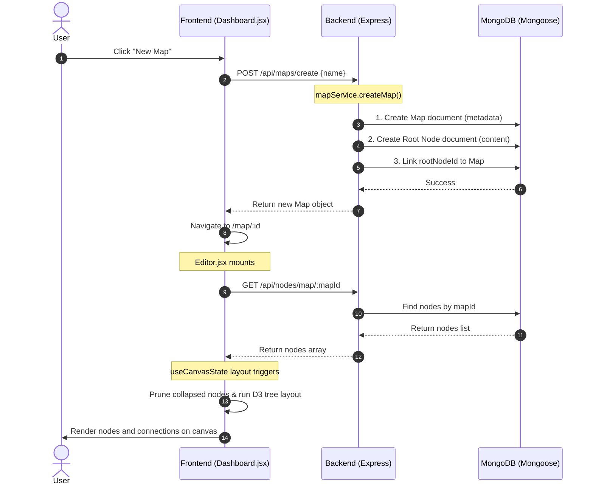

### 2. AI Node Generation Flow (SSE Streaming)

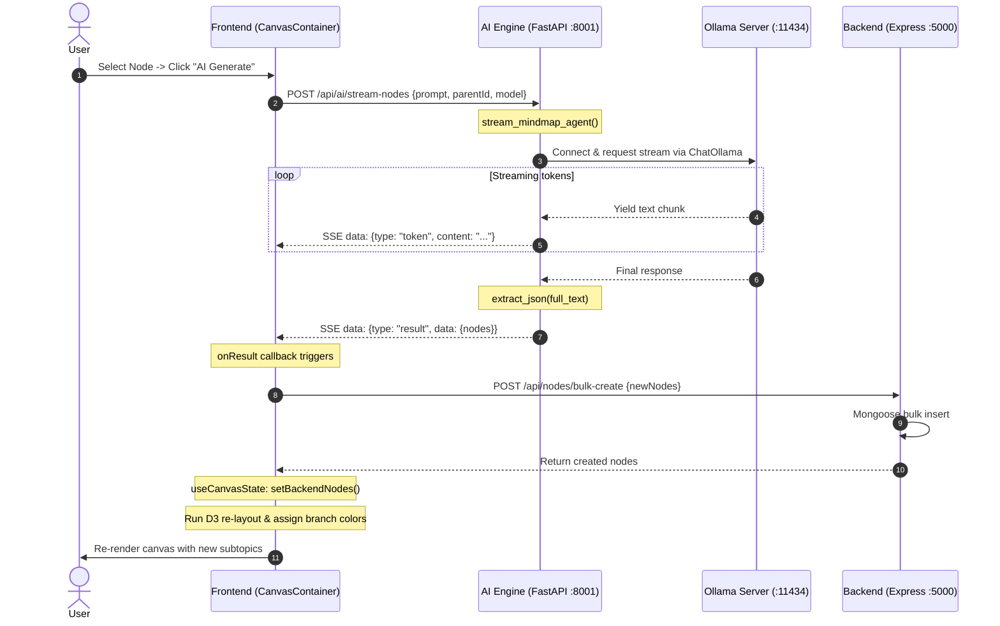

### 3. Node Interaction Flow

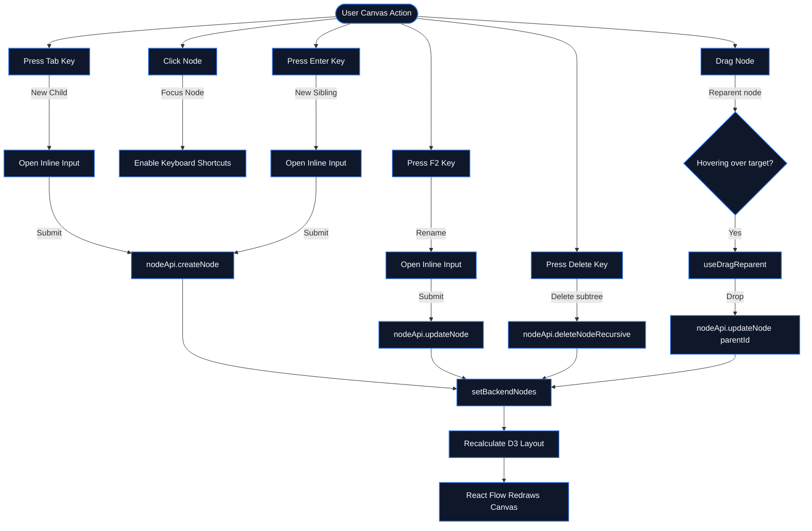

---

## 🚀 Getting Started

### Prerequisites

- **Node.js** ≥ 18.x
- **MongoDB** ≥ 7.x (running locally or Atlas URI)
- **Python** ≥ 3.10 (for AI Engine)
- **Ollama** (optional, for AI features — [install guide](https://ollama.com))

### 1. Clone the Repository

```bash
git clone https://github.com/AkshatRaj/AxonFlow.git
cd AxonFlow
```

### 2. Backend Setup

```bash
cd backend
npm install

# Create .env file from template
cp .env.example .env
# Edit .env with your MongoDB URI

# Start development server
npm run dev
```

### 3. Frontend Setup

```bash
cd frontend
npm install

# Start Vite dev server
npm run dev
```

### 4. AI Engine Setup (Optional)

```bash
cd ai-engine

# Create virtual environment
python -m venv venv
source venv/bin/activate        # macOS/Linux
# venv\Scripts\activate         # Windows

# Install dependencies
pip install -r requirements.txt

# Ensure Ollama is running with at least one model
ollama pull llama3

# Start FastAPI server
uvicorn main:app --host 0.0.0.0 --port 8001 --reload
```

### 5. Open the App

Navigate to `http://localhost:5173` in your browser.

---

## 🔐 Environment Variables

### Backend (`/backend/.env`)

| Variable | Default | Description |
|----------|---------|-------------|
| `PORT` | `5000` | Express server port |
| `MONGODB_URI` | `mongodb://localhost:27017/axonflow_db` | MongoDB connection string |
| `CLERK_PUBLISHABLE_KEY` | — | Clerk auth public key (future) |
| `CLERK_SECRET_KEY` | — | Clerk auth secret key (future) |
| `UPLOAD_PATH` | `./uploads` | File upload directory |

### Frontend (`/frontend/.env.local`)

| Variable | Default | Description |
|----------|---------|-------------|
| `VITE_API_URL` | `http://localhost:5000/api` | Backend API base URL |
| `VITE_AI_ENGINE_URL` | `http://localhost:8001` | AI Engine base URL |

---

## 🏛 System Design

### High-Level Design (HLD)

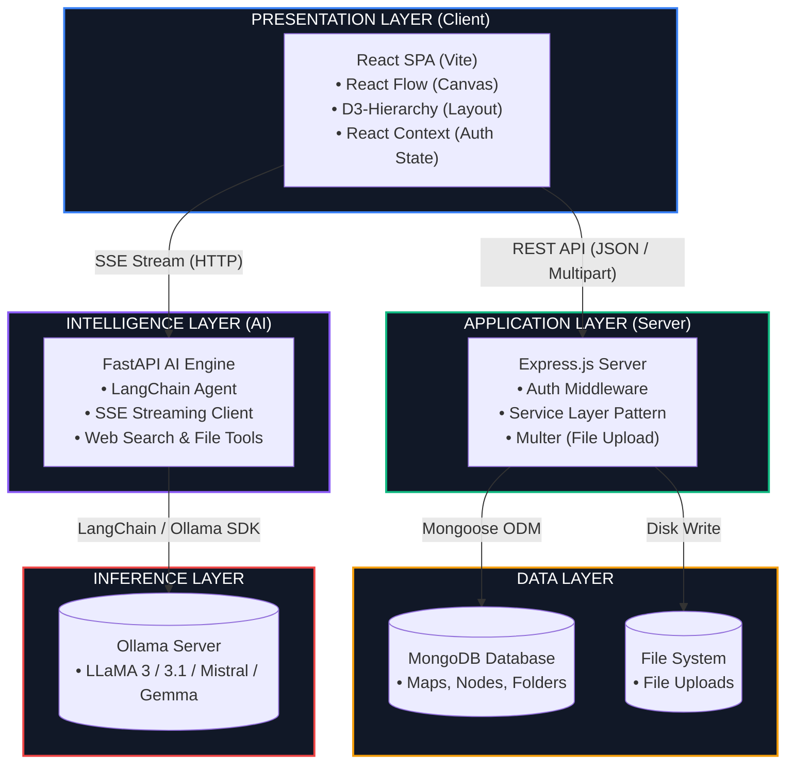

### Low-Level Design (LLD)

#### Backend Service Layer Pattern

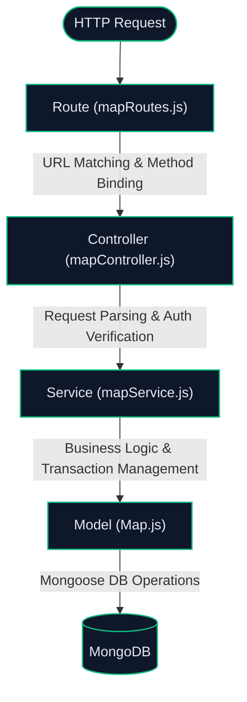

#### Frontend State Management Pattern

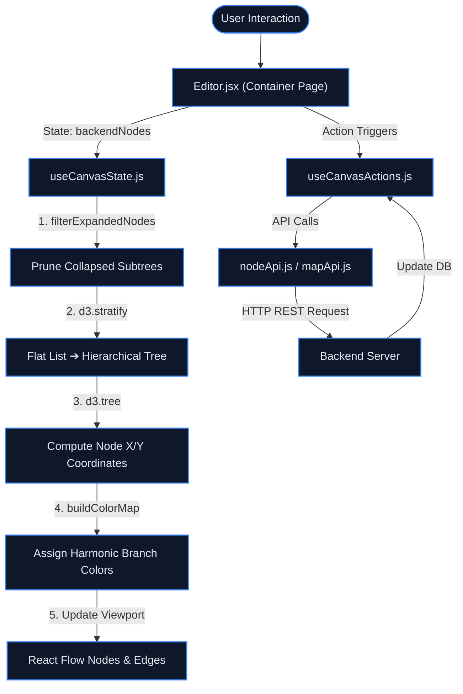

#### AI Agent Architecture

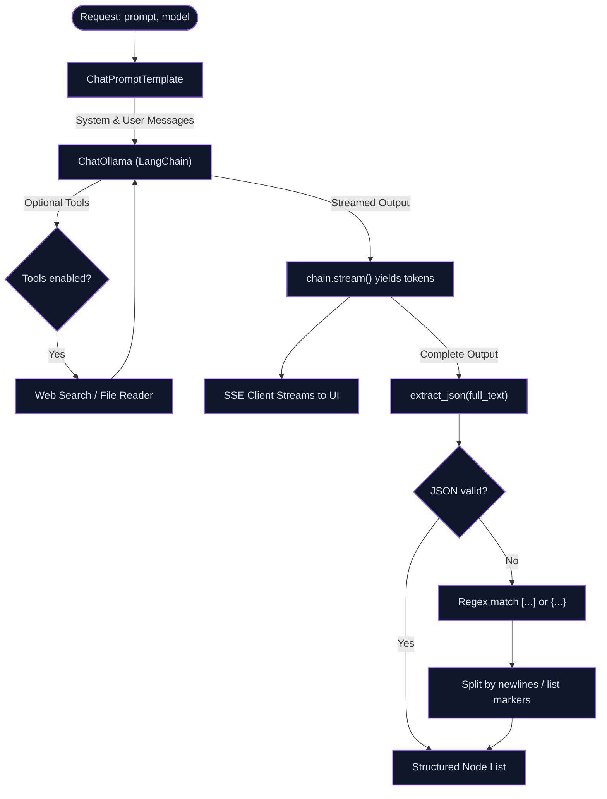

---

## 🧩 Use Case Diagram

```mermaid
flowchart LR
    User(((User)))
    
    subgraph Boundary ["AxonFlow System Boundary"]
        subgraph Group1 ["Workspace & File Management"]
            UC1(["Create & Organize Workspaces/Folders"])
            UC2(["Manage Mind Maps (Duplicate, Trash, Favorite)"])
        end
        
        subgraph Group2 ["Canvas Interactions"]
            UC3(["Edit Nodes (Add, Rename, Delete)"])
            UC4(["Reparent Nodes via Drag & Drop"])
            UC5(["Customize Canvas (Layouts, Colors)"])
            UC6(["Attach Content (Notes, Links, Files)"])
            UC7(["Bulk Import Indented Text"])
        end
        
        subgraph Group3 ["AI Capabilities"]
            UC8(["Select Ollama LLM Model"])
            UC9(["Stream Node Subtopics via SSE"])
            UC10(["Auto-generate Complete Mind Maps"])
        end
    end
    
    AIEngine(((AI Engine)))

    %% User Connections
    User --> UC1
    User --> UC2
    User --> UC3
    User --> UC4
    User --> UC5
    User --> UC6
    User --> UC7
    User --> UC8
    User --> UC9
    User --> UC10

    %% AI Connections
    UC9 --> AIEngine
    UC10 --> AIEngine

    %% Styling
    classDef actor fill:#3b82f6,stroke:#1d4ed8,stroke-width:2px,color:#fff;
    classDef usecase fill:#0f172a,stroke:#06b6d4,stroke-width:1.5px,color:#e2e8f0;
    classDef system fill:#090d16,stroke:#3b82f6,stroke-dasharray: 5 5,color:#fff;
    
    class User,AIEngine actor;
    class UC1,UC2,UC3,UC4,UC5,UC6,UC7,UC8,UC9,UC10 usecase;
    style Boundary fill:#070a13,stroke:#1e293b,stroke-width:2px;
```

---

## 📊 UML Class Diagram

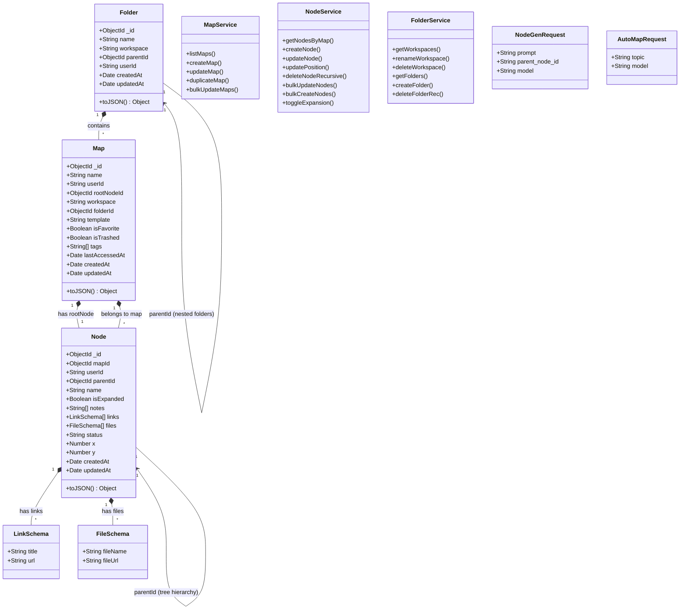

---

## 🧩 Frontend Component Architecture
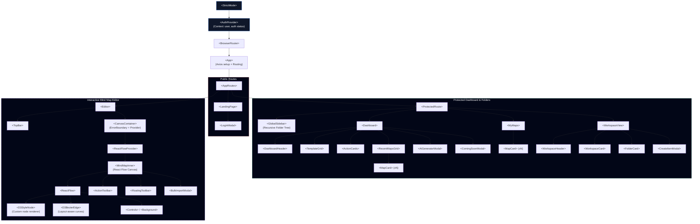

---

## 🗺 Roadmap

- [x] Core mind-mapping canvas with React Flow
- [x] D3-powered layout engine (horizontal, vertical, radial)
- [x] Backend REST API with full CRUD
- [x] AI node generation with Ollama/LangChain
- [x] SSE streaming for real-time AI responses
- [x] Workspace & folder organization system
- [x] File attachments & notes per node
- [x] Multi-theme support (dark, light, neon)
- [x] Bulk import from indented text
- [x] Map duplication with recursive node cloning
- [ ] Clerk authentication integration (prepared, not active)
- [ ] Real-time collaboration (WebSocket/CRDT)
- [ ] Export to PDF / PNG / Markdown
- [ ] Node-level deadlines & Gantt view
- [ ] Template marketplace
- [ ] Mobile-responsive canvas
- [ ] Shared maps & permission system
- [ ] Version history & undo/redo

---

## 👤 Author

**Akshat Raj** — [GitHub](https://github.com/AkshatRaj)

---

## 📜 License

This project is licensed under the [MIT License](./LICENSE).